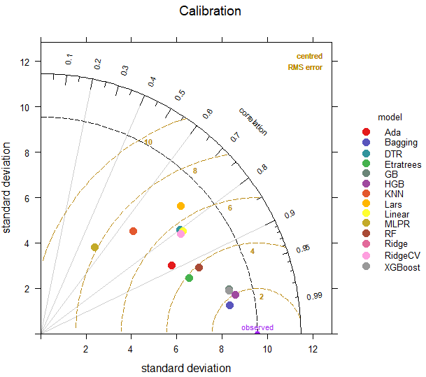
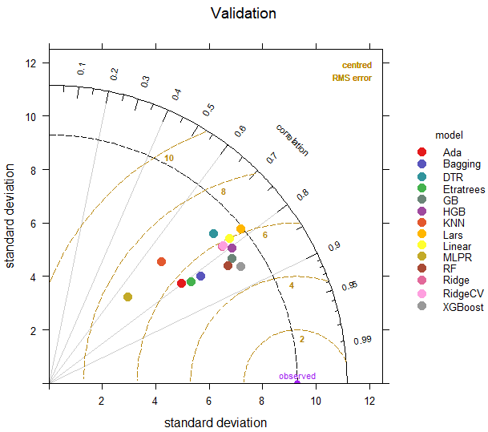

# Actual Evapotranspiration Framework for Arid Regions

This repository contains code for a comprehensive spatiotemporal framework to predict Actual Evapotranspiration (ETa) in Arid Regions, like the Central Valley of California using satellite data, machine learning techniques, and the Budyko Framework, as described in the study titled *"A Novel Method to Estimate Actual Evapotranspiration using Modified Budyko Model under Data Scarcity Conditions in Arid Regions."*

## Overview

The project leverages:
- Google Earth Engine (GEE) for data collection
- Fitting different Budyko prameter (Fu, Turc-Pike, Zhang, and Wang-Tang)
- Machine learning models (Random Forest Regressor, AdaBoost Regressor, Bagging Regressor, Extra Trees Regressor, Gradient Boosting Regressor, Hist Gradient Boosting Regressor, Extreme Gradient Boosting, Ridge, Least Angle Regression (Lars), RidgeCV, Linear Regression, Multi-Layer Perceptron Regressor - MLPR, K-Nearest Neighbors - KNN, and Decision Tree Regressor - DTR) for ETa prediction
- SHAP analysis for feature importance
- Hyperparameter tuning
- Input preprocessing
- Model training and validation
- Feature selection
- Taylor diagram

The study covers data from 2001 to 2022 and includes climatic, landuse, and vegitation variables.
## Key Results

### 1. Model Performance
- **Best Models**:
  - Budyko model (Zhang): NRMSE=0.10, R²=0.78, NSE=0.77
  - Budyko model (Turc-Pike): NRMSE=0.10, R²=0.77, NSE=0.76
  - Budyko model (Fu): NRMSE=0.11, R²=0.77, NSE=0.76
  - Budyko model (Wang-Tang): NRMSE=0.11, R²=0.77, NSE=0.75
  
  - ML (XGB7): NRMSE=0.11, R²=0.73, NSE=0.73
  - ML (RF3): NRMSE=0.12, R²=0.70, NSE=0.70
  - ML (GB5): NRMSE=0.13, R²=0.68, NSE=0.68
  - ML (Ada6): NRMSE=0.14, R²=0.62, NSE=0.60


### 2. Key Predictors (SHAP) - Feature Selection
```python
  - XGB7: ['ppt', 'lat', 'soil_water_1', 'r_max', 'Srad', 'lon', 'soilT_4']
  - RF3: ['ppt', 'r_max', 'lat']
  - GB5: ['ppt', 'lat', 'r_max', 'ss_flux_max', 'st_r_d_max']
  - Ada6: ['ppt', 'r_max', 'ss_flux_max', 'lai_high', 'pr', 'st_r_d_max']

```
### 3. Budyko Parameter (ω)
- **Monthly Averaged Time scale**:
  - Fu : 9.3
  - Turc-Pike : 8.6 
  - Zhang : 5
  - Wang-Tang : 0.91
- **long-term monthly average Time scale(LT monthly)**:
  - Fu : 4.1
  - Turc-Pike : 3.3 
  - Zhang : 4.5
  - Wang-Tang : 0.8
- **Annual Time scale**:
  - Fu : 2.22
  - Turc-Pike : 1.46 
  - Zhang : 0.39
  - Wang-Tang : 0.45


#### Evaluation ML Models
<div style="display: flex; justify-content: space-between;">
  
  
</div>
*Figure 2: Left - Taylor diagram of ETa prediction Machine Learning models during the calibration; Right - validation magnitudes*

#### Hyperparameter tuning
| Model                      | Hyperparameters                                            |
|----------------------------|------------------------------------------------------------|
| Random Forest Regressor    | - Max. Depth: None
                               - Number of Trees: 50
                               - Min. Samples to Split: 5
                               - Best Nodes: 20
                               - Bootstrap Samples: None                                  |
| Gradient Boosting Regressor| - Learning Rate: 0.1
                               - Sample Fraction: 0.75
                               - Boost Stages: 200
                               - Max. Depth: 6                                            |
| AdaBoost Regressor         | - Max. Estimators: 50
                               - Regressor Weight: 0.25
                               - Loss Function: Linear                                    |
| Extreme Gradient Boosting  | - Number of boosting rounds: 100
                               - Maximum depth of a tree: 3
                               - Step size shrinkage: 0.1
                               - Minimum loss reduction required to make a further partition on a leaf node: 0.2
                               - Subsample ratio of the training instances: 1
                               - Subsample ratio of columns when constructing each tree: 1|

## Repository Structure

- `Era5_data.ipynb` and `Terra_data.ipynb`: Jupyter notebook for collecting satellite and meteorological data using Google Earth Engine (e.g., TerraClimate, ERA5).
- `fit_curve_budyko_with_label.R`: Core modeling notebook implementing all 4 Budyko models.
- `eddy_data.ipynb`: Input preprocessing.
- `clusster_gridsearchcv.ipynb`: Core modeling notebook implementing all 14 ML models.
- `plot_obs_sim.ipynb`: Scatter plot for ML and Budyko Models.
- `taylor_diagram.R`: Taylor Diagram.
- `SHAP_FI.ipynb`: SHAP analysis.
- `time_series_change_terra.R`: Time series scatter.
- `requirements.txt`: List of Python dependencies required to run the code.

## Prerequisites

- **Python**: Version 3.8 or higher.
- **Google Earth Engine Account**: Required for data collection. [Sign up here](https://earthengine.google.com).
- **Dependencies**: Install required libraries using:
  ```bash
  pip install -r requirements.txt
  ## Key Dependencies

The main Python dependencies include:
- `earthengine-api`
- `pandas`
- `numpy`
- `scikit-learn`
- `xgboost`
- `shap`
- `matplotlib` (for visualizations)
- `pyarrow`
- `xarray`
- `plotly`
- `scipy`
- `tqdm`
- `seaborn`
- `pyet`
- `datetime`
- `geopandas`
- `shapely`
- `wxee`

## Setup Instructions

### Clone the Repository
```bash
git clone git@github.com:mahdimohammadnezhad/Estimation_ETa.git
cd Estimation_ETa
```
## Setup Instructions

### Install Dependencies
```bash
pip install -r requirements.txt
```
### Authenticate Google Earth Engine
Run the following command and follow the prompts to authenticate:

```bash
earthengine authenticate
```

## Contact

For support or inquiries:
- 🐛 **Report Issues**:  
  [Open a new issue](https://github.com/mahdimohammadnezhad/Estimation_ETa/issues) on GitHub
- 📧 **Email Contact**:  
  [mohammadnezhad@alumni.um.ac.ir](mohammadnezhad@alumni.um.ac.ir) 
- 💬 **Discussion Forum**:  
  Consider adding a GitHub Discussions tab to your repository for community questions

## Citation


```bibtex
@article{mohammadnezhad2025evapotranspiration,
  title={A Novel Method to Estimate Actual Evapotranspiration using Modified Budyko Model under Data Scarcity Conditions in Arid Regions},
  author={Mohammadnezhad, Mahdi and Collaborators},
  journal={Journal Name},
  volume={XX},
  pages={XXX--XXX},
  year={2025},
  publisher={Publisher}
}
